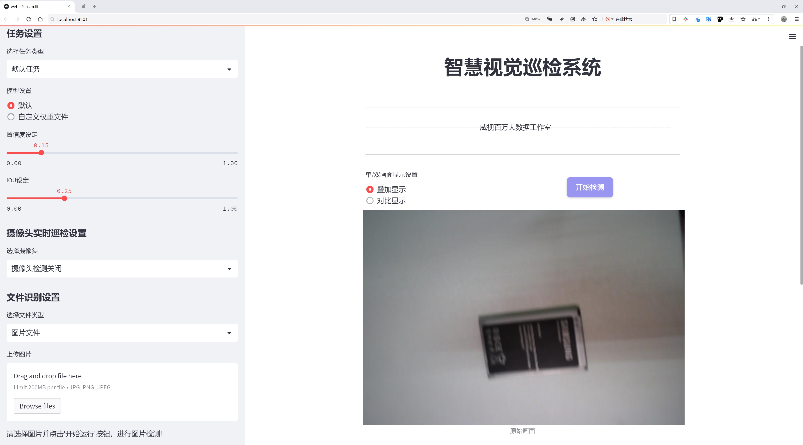
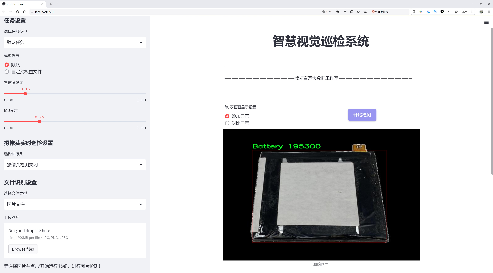
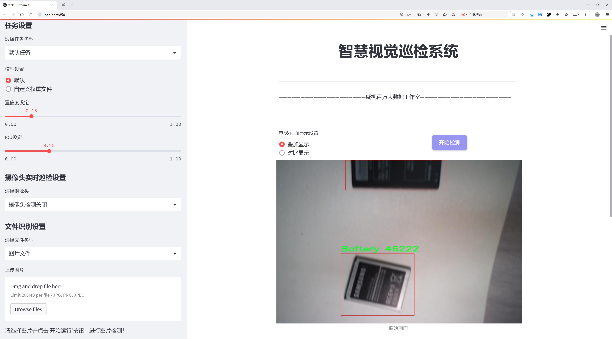
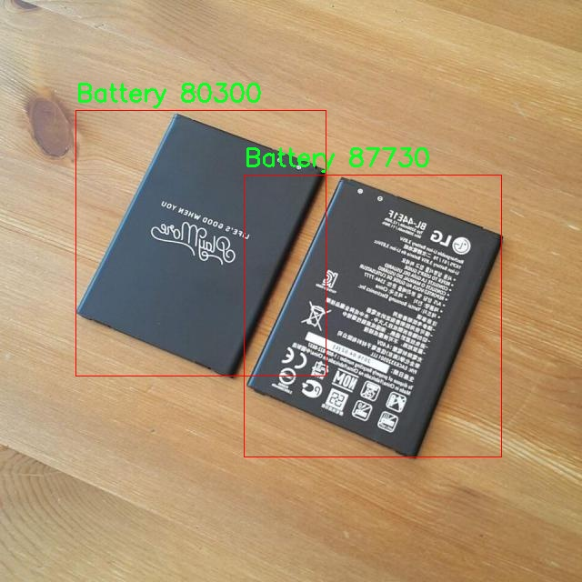
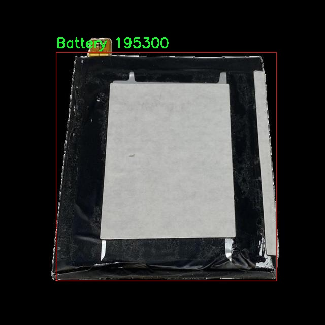

# 电子废物检测回收检测系统源码分享
 # [一条龙教学YOLOV8标注好的数据集一键训练_70+全套改进创新点发刊_Web前端展示]

### 1.研究背景与意义

项目参考[AAAI Association for the Advancement of Artificial Intelligence](https://gitee.com/qunshansj/projects)

项目来源[AACV Association for the Advancement of Computer Vision](https://gitee.com/qunmasj/projects)

研究背景与意义

随着全球电子产品的快速发展和普及，电子废物（E-waste）问题日益严重。根据联合国环境规划署的报告，全球每年产生的电子废物数量已超过5000万吨，预计到2030年这一数字将达到7400万吨。电子废物不仅占用了大量的资源，还对环境和人类健康造成了潜在的威胁。电子产品中含有多种有害物质，如重金属和有机污染物，这些物质在不当处理时会渗入土壤和水源，造成生态环境的破坏。因此，开发高效的电子废物检测与回收系统，能够有效促进资源的循环利用，减少环境污染，具有重要的现实意义。

在此背景下，基于改进YOLOv8的电子废物检测回收系统应运而生。YOLO（You Only Look Once）系列模型因其高效的实时目标检测能力而受到广泛关注。YOLOv8作为该系列的最新版本，具备更高的检测精度和速度，适合在复杂环境中进行电子废物的自动识别与分类。通过对YOLOv8模型的改进，可以进一步提升其在电子废物检测中的性能，特别是在处理多类别物体时的准确性和鲁棒性。

本研究使用的数据集包含2500张图像，涵盖了四个主要类别：电池、相机、液晶显示器（LCD）和印刷电路板（PCB）。这些类别代表了电子废物中常见的组成部分，各自具有不同的物理特性和回收价值。通过对这些类别的深入分析和模型训练，可以实现对电子废物的高效分类与识别，从而为后续的回收处理提供准确的数据支持。

在技术层面，改进YOLOv8模型的研究不仅有助于提升电子废物检测的效率，还能够为其他领域的目标检测提供借鉴。例如，在工业自动化、智能监控等领域，快速、准确的目标识别技术同样具有重要的应用价值。此外，随着人工智能技术的不断发展，基于深度学习的目标检测方法将在更多的实际应用中发挥关键作用。

从社会层面来看，电子废物的有效检测与回收不仅能够减少环境污染，还能够促进资源的可持续利用，推动循环经济的发展。通过构建高效的电子废物检测回收系统，可以提高公众对电子废物回收的意识，鼓励更多的企业和个人参与到电子废物的回收与再利用中来，从而形成良好的社会氛围。

综上所述，基于改进YOLOv8的电子废物检测回收系统的研究，既具有重要的学术价值，也具有显著的社会意义。通过本研究的深入开展，将为电子废物的管理与回收提供新的思路和方法，推动相关领域的技术进步与应用落地，为实现可持续发展目标贡献力量。

### 2.图片演示







##### 注意：由于此博客编辑较早，上面“2.图片演示”和“3.视频演示”展示的系统图片或者视频可能为老版本，新版本在老版本的基础上升级如下：（实际效果以升级的新版本为准）

  （1）适配了YOLOV8的“目标检测”模型和“实例分割”模型，通过加载相应的权重（.pt）文件即可自适应加载模型。

  （2）支持“图片识别”、“视频识别”、“摄像头实时识别”三种识别模式。

  （3）支持“图片识别”、“视频识别”、“摄像头实时识别”三种识别结果保存导出，解决手动导出（容易卡顿出现爆内存）存在的问题，识别完自动保存结果并导出到tempDir中。

  （4）支持Web前端系统中的标题、背景图等自定义修改，后面提供修改教程。

  另外本项目提供训练的数据集和训练教程,暂不提供权重文件（best.pt）,需要您按照教程进行训练后实现图片演示和Web前端界面演示的效果。

### 3.视频演示

[3.1 视频演示](https://www.bilibili.com/video/BV1cK4mebEHt/)

### 4.数据集信息展示

##### 4.1 本项目数据集详细数据（类别数＆类别名）

nc: 4
names: ['Battery', 'Camera', 'LCD', 'PCB']


##### 4.2 本项目数据集信息介绍

数据集信息展示

在当今数字化时代，电子废物的处理与回收成为了一个亟待解决的环境问题。为了解决这一问题，我们构建了一个专门用于训练改进YOLOv8的电子废物检测回收系统的数据集，命名为“E-waste detection”。该数据集旨在为电子废物的自动识别与分类提供强有力的支持，从而提升回收效率，减少环境污染。

“E-waste detection”数据集包含四个主要类别，分别是电池（Battery）、相机（Camera）、液晶显示器（LCD）和印刷电路板（PCB）。这些类别代表了电子废物中常见的组成部分，涵盖了从消费电子产品到工业设备的广泛范围。每个类别的选择都经过了深思熟虑，旨在反映当前电子废物回收行业的实际需求与挑战。

在数据集的构建过程中，我们注重数据的多样性与代表性。每个类别下的数据样本均来自于不同的来源，确保涵盖了各种形态、尺寸和颜色的电子废物。这种多样性不仅增强了模型的泛化能力，还能有效应对现实世界中可能遇到的各种情况。例如，电池样本包括了锂电池、镍氢电池等不同类型，而相机样本则涵盖了数码相机、监控摄像头等多种设备。这种丰富的样本库使得模型在实际应用中能够更准确地识别和分类不同类型的电子废物。

数据集的标注工作也同样重要。我们采用了严格的标注标准，确保每个样本都经过专业人员的仔细审查与标注。每个类别的样本都附有详细的标签信息，包括类别名称、边界框坐标等。这些信息为模型的训练提供了坚实的基础，使其能够在复杂的环境中快速而准确地进行目标检测。

在训练过程中，我们将“E-waste detection”数据集与改进的YOLOv8模型相结合，旨在提升电子废物检测的准确性与效率。YOLOv8作为一种先进的目标检测算法，具有快速响应和高精度的特点，非常适合于实时检测任务。通过使用这一数据集，我们期望能够训练出一个能够在各种环境下高效工作的电子废物检测系统，从而为电子废物的回收利用提供技术支持。

此外，数据集的开放性也为研究人员和开发者提供了宝贵的资源。我们鼓励学术界和工业界的同行使用这一数据集进行相关研究，推动电子废物检测技术的发展。通过共享数据集，我们希望能够促进技术的进步，最终实现更高效的电子废物管理与回收系统。

总之，“E-waste detection”数据集不仅是一个用于训练YOLOv8模型的工具，更是推动电子废物检测与回收技术进步的重要资源。通过不断优化与扩展这一数据集，我们期望在未来能够为环境保护贡献一份力量。







### 5.全套项目环境部署视频教程（零基础手把手教学）

[5.1 环境部署教程链接（零基础手把手教学）](https://www.ixigua.com/7404473917358506534?logTag=c807d0cbc21c0ef59de5)


[5.2 安装Python虚拟环境创建和依赖库安装视频教程链接（零基础手把手教学）](https://www.ixigua.com/7404474678003106304?logTag=1f1041108cd1f708b01a)

### 6.手把手YOLOV8训练视频教程（零基础小白有手就能学会）

[6.1 手把手YOLOV8训练视频教程（零基础小白有手就能学会）](https://www.ixigua.com/7404477157818401292?logTag=d31a2dfd1983c9668658)

### 7.70+种全套YOLOV8创新点代码加载调参视频教程（一键加载写好的改进模型的配置文件）

[7.1 70+种全套YOLOV8创新点代码加载调参视频教程（一键加载写好的改进模型的配置文件）](https://www.ixigua.com/7404478314661806627?logTag=29066f8288e3f4eea3a4)

### 8.70+种全套YOLOV8创新点原理讲解（非科班也可以轻松写刊发刊，V10版本正在科研待更新）

由于篇幅限制，每个创新点的具体原理讲解就不一一展开，具体见下列网址中的创新点对应子项目的技术原理博客网址【Blog】：


[8.1 70+种全套YOLOV8创新点原理讲解链接](https://gitee.com/qunmasj/good)

### 9.系统功能展示（检测对象为举例，实际内容以本项目数据集为准）

图9.1.系统支持检测结果表格显示

  图9.2.系统支持置信度和IOU阈值手动调节

  图9.3.系统支持自定义加载权重文件best.pt(需要你通过步骤5中训练获得)

  图9.4.系统支持摄像头实时识别

  图9.5.系统支持图片识别

  图9.6.系统支持视频识别

  图9.7.系统支持识别结果文件自动保存

  图9.8.系统支持Excel导出检测结果数据


### 10.原始YOLOV8算法原理

原始YOLOv8算法原理

YOLOv8算法是目标检测领域的一次重要进化，由Glenn-Jocher提出，作为YOLO系列的最新版本，YOLOv8在多个方面进行了显著的改进和创新，旨在提高目标检测的精度和效率。其架构由输入层、主干网络、颈部网络和头部网络等主要组件构成，形成了一个高效的特征提取和目标检测流程。

在YOLOv8中，输入图像首先会被缩放至指定的尺寸，以适应网络的输入要求。主干网络负责对图像进行特征提取，其核心是通过卷积操作实现下采样。每个卷积层都包含批归一化和SiLUR激活函数，这种设计使得网络在训练过程中能够更快地收敛并提高了模型的非线性表达能力。主干网络的设计灵感部分来源于YOLOv5，采用了清晰的架构规律，通过步长为2的3×3卷积层进行特征图的降采样，接着通过C2f模块进一步强化特征提取。C2f模块的引入是YOLOv8的一大亮点，它借鉴了YOLOv7中的E-ELAN结构，通过跨层分支连接增强了模型的梯度流动，改善了检测结果。这种设计不仅丰富了特征的表达能力，还提高了网络对不同尺度目标的适应性。

在主干网络的末尾，YOLOv8引入了SPPFl模块，该模块通过三个最大池化层处理多尺度特征，进一步增强了网络的特征抽象能力。这种多尺度特征处理的方式，使得YOLOv8在面对复杂场景时，能够更好地捕捉到目标的多样性和变化性。

颈部网络的设计同样至关重要，YOLOv8采用了FPN（特征金字塔网络）和PAN（路径聚合网络）结构，以融合不同尺度特征图的信息。这种特征融合策略使得YOLOv8能够有效地整合来自主干网络的多层次特征，确保在目标检测过程中，网络能够充分利用每一层的特征信息，提升检测的准确性和鲁棒性。

在检测头的设计上，YOLOv8进行了革命性的改进，采用了解耦的检测头结构。与之前版本的耦合检测头不同，YOLOv8通过两个并行的卷积分支分别计算回归和类别的损失，这种解耦设计使得模型在处理分类和定位任务时能够更加专注，避免了两者之间的干扰，提高了整体的检测性能。

此外，YOLOv8在数据预处理方面延续了YOLOv5的策略，采用了马赛克增强、混合增强、空间扰动和颜色扰动等多种增强手段，以提高模型的泛化能力和鲁棒性。在标签分配策略上，YOLOv8采用了TOOD策略，这是一种动态标签分配方法，旨在解决正负样本匹配的多尺度分配问题。通过这种方式，YOLOv8能够更准确地处理不同尺度目标的检测任务，提升了模型在复杂场景下的表现。

YOLOv8的损失函数设计也体现了其创新性。分类损失采用了VFL Loss（Varifocal Loss），而回归损失则结合了CIoULoss与DFLLoss。VFL Loss通过不对称参数对正负样本进行加权，使得模型在训练过程中能够更加关注高质量的正样本，从而提升检测精度。对于负样本，VFL Loss则通过衰减其对损失的贡献，确保模型在学习过程中不会受到过多低质量样本的干扰。

总的来说，YOLOv8在保留YOLO系列一贯的高效性和易用性的基础上，通过引入C2f模块、解耦检测头、动态标签分配策略以及创新的损失函数等多项技术，显著提升了目标检测的精度和速度。其在计算机视觉领域的应用潜力巨大，不仅适用于传统的目标检测任务，还扩展到了实例分割和姿态评估等更复杂的任务中，展现了其广泛的适用性和强大的性能。随着YOLOv8的推出，目标检测技术将迎来新的发展机遇，为各类智能应用提供更为强大的支持。


### 11.项目核心源码讲解（再也不用担心看不懂代码逻辑）

#### 11.1 code\ultralytics\utils\checks.py

以下是对给定代码的核心部分进行分析和详细注释的结果：

```python
import re
from pathlib import Path
from typing import List, Dict, Optional
from ultralytics.utils import SimpleNamespace, LOGGER

def parse_requirements(file_path=Path("requirements.txt"), package="") -> List[Dict[str, str]]:
    """
    解析 requirements.txt 文件，忽略以 '#' 开头的行和 '#' 后的任何文本。

    参数:
        file_path (Path): requirements.txt 文件的路径。
        package (str, optional): 要使用的 Python 包名，如果提供则忽略文件内容。

    返回:
        List[Dict[str, str]]: 解析后的需求列表，每个需求为包含 `name` 和 `specifier` 的字典。
    """
    if package:
        # 如果提供了包名，则获取该包的依赖
        requires = [x for x in metadata.distribution(package).requires if "extra == " not in x]
    else:
        # 从文件中读取依赖
        requires = Path(file_path).read_text().splitlines()

    requirements = []
    for line in requires:
        line = line.strip()
        if line and not line.startswith("#"):
            line = line.split("#")[0].strip()  # 忽略行内注释
            match = re.match(r"([a-zA-Z0-9-_]+)\s*([<>!=~]+.*)?", line)
            if match:
                # 将解析出的需求添加到列表中
                requirements.append(SimpleNamespace(name=match[1], specifier=match[2].strip() if match[2] else ""))

    return requirements


def check_version(current: str, required: str, name: str = "version", hard: bool = False, verbose: bool = False) -> bool:
    """
    检查当前版本是否满足所需版本或范围。

    参数:
        current (str): 当前版本或包名。
        required (str): 所需版本或范围（以 pip 风格格式）。
        name (str, optional): 在警告消息中使用的名称。
        hard (bool, optional): 如果为 True，则在不满足要求时引发 AssertionError。
        verbose (bool, optional): 如果为 True，则在不满足要求时打印警告消息。
    
    返回:
        bool: 如果满足要求则返回 True，否则返回 False。
    """
    if not current:
        LOGGER.warning(f"WARNING ⚠️ invalid check_version({current}, {required}) requested, please check values.")
        return True

    # 解析当前版本
    c = parse_version(current)
    result = True
    for r in required.strip(",").split(","):
        op, version = re.match(r"([^0-9]*)([\d.]+)", r).groups()  # 分离操作符和版本号
        v = parse_version(version)
        # 根据操作符检查版本
        if op == "==" and c != v:
            result = False
        elif op == "!=" and c == v:
            result = False
        elif op in (">=", "") and not (c >= v):
            result = False
        elif op == "<=" and not (c <= v):
            result = False
        elif op == ">" and not (c > v):
            result = False
        elif op == "<" and not (c < v):
            result = False

    if not result:
        warning = f"WARNING ⚠️ {name}{op}{version} is required, but {name}=={current} is currently installed."
        if hard:
            raise ModuleNotFoundError(warning)
        if verbose:
            LOGGER.warning(warning)
    return result


def check_python(minimum: str = "3.8.0") -> bool:
    """
    检查当前 Python 版本是否满足所需的最低版本。

    参数:
        minimum (str): 所需的最低 Python 版本。

    返回:
        bool: 如果当前版本满足要求则返回 True，否则返回 False。
    """
    return check_version(platform.python_version(), minimum, name="Python ", hard=True)


def check_requirements(requirements=Path("requirements.txt"), exclude=(), install=True, cmds="") -> bool:
    """
    检查已安装的依赖项是否满足要求，并在需要时尝试自动更新。

    参数:
        requirements (Union[Path, str, List[str]]): requirements.txt 文件的路径，单个包需求字符串，或包需求字符串列表。
        exclude (Tuple[str]): 要排除的包名元组。
        install (bool): 如果为 True，则尝试自动更新不满足要求的包。
        cmds (str): 在自动更新时传递给 pip install 命令的附加命令。

    返回:
        bool: 如果所有要求都满足则返回 True，否则返回 False。
    """
    check_python()  # 检查 Python 版本
    if isinstance(requirements, Path):
        file = requirements.resolve()
        assert file.exists(), f"requirements file {file} not found."
        requirements = [f"{x.name}{x.specifier}" for x in parse_requirements(file) if x.name not in exclude]
    elif isinstance(requirements, str):
        requirements = [requirements]

    pkgs = []
    for r in requirements:
        match = re.match(r"([a-zA-Z0-9-_]+)([<>!=~]+.*)?", r)
        name, required = match[1], match[2].strip() if match[2] else ""
        try:
            assert check_version(metadata.version(name), required)
        except (AssertionError, metadata.PackageNotFoundError):
            pkgs.append(r)

    if pkgs and install:
        # 如果需要更新包
        LOGGER.info(f"Ultralytics requirements {pkgs} not found, attempting AutoUpdate...")
        try:
            assert is_online(), "AutoUpdate skipped (offline)"
            subprocess.check_output(f"pip install --no-cache {' '.join(pkgs)} {cmds}", shell=True)
            LOGGER.info(f"AutoUpdate success ✅ installed packages: {pkgs}")
        except Exception as e:
            LOGGER.warning(f"AutoUpdate failed ❌ {e}")
            return False

    return True
```

### 代码分析与注释

1. **`parse_requirements` 函数**:
   - 该函数用于解析 `requirements.txt` 文件，提取出每个依赖包的名称和版本要求，并返回一个包含这些信息的列表。

2. **`check_version` 函数**:
   - 该函数用于检查当前版本是否满足所需版本的要求。它支持多种比较操作符（如 `==`, `!=`, `>=`, `<` 等），并根据需要输出警告信息。

3. **`check_python` 函数**:
   - 检查当前 Python 版本是否满足最低要求。

4. **`check_requirements` 函数**:
   - 该函数检查已安装的依赖项是否满足要求，并在需要时尝试自动更新不满足要求的包。它首先检查 Python 版本，然后解析 `requirements.txt` 文件中的依赖项，并逐一验证每个包的版本。

以上代码片段展示了如何处理依赖项的解析和版本检查，这在任何需要管理 Python 包依赖的项目中都是非常重要的。

这个文件 `checks.py` 是 Ultralytics YOLO 项目中的一个工具模块，主要用于检查和验证环境配置、依赖关系、文件路径等。文件中包含了多个函数，每个函数都有特定的功能，下面是对这些函数的逐一说明。

首先，文件导入了一系列必要的库，包括标准库和第三方库，如 `requests`、`torch` 和 `cv2` 等。接着，定义了一些实用的工具函数。

`parse_requirements` 函数用于解析 `requirements.txt` 文件，提取出需要的依赖包及其版本信息。它会忽略以 `#` 开头的注释行，并返回一个包含包名和版本规范的字典列表。

`parse_version` 函数将版本字符串转换为整数元组，方便进行版本比较。它会忽略版本字符串中的非数字部分，并返回一个包含主要、次要和修订号的元组。

`is_ascii` 函数检查一个字符串是否仅由 ASCII 字符组成，返回布尔值。

`check_imgsz` 函数用于验证图像尺寸是否为给定步幅的倍数。如果不是，它会将其调整为最接近的有效尺寸。

`check_version` 函数用于检查当前版本是否满足所需版本的要求，可以进行精确匹配或范围匹配，并可以选择是否抛出异常或打印警告信息。

`check_latest_pypi_version` 函数通过访问 PyPI 获取指定包的最新版本信息，而 `check_pip_update_available` 函数则检查当前安装的包是否有可用的更新。

`check_font` 函数用于查找本地字体文件，如果未找到，则从指定 URL 下载字体文件。

`check_python` 函数检查当前 Python 版本是否满足最低要求。

`check_requirements` 函数检查已安装的依赖是否满足 YOLOv8 的要求，并尝试自动更新不满足要求的包。

`check_torchvision` 函数检查安装的 PyTorch 和 Torchvision 版本是否兼容，并给出相应的警告。

`check_suffix` 函数检查文件的后缀是否符合要求。

`check_yolov5u_filename` 函数用于替换旧的 YOLOv5 文件名为更新的 YOLOv5u 文件名。

`check_model_file_from_stem` 函数根据模型的基础名称返回模型文件名。

`check_file` 函数用于搜索或下载文件，并返回其路径。

`check_yaml` 函数用于检查 YAML 文件的存在性，并返回其路径。

`check_is_path_safe` 函数检查解析后的路径是否在预期目录下，以防止路径遍历攻击。

`check_imshow` 函数检查当前环境是否支持图像显示。

`check_yolo` 函数返回 YOLO 软件和硬件的可读性摘要，并收集系统信息。

`collect_system_info` 函数收集并打印相关的系统信息，包括操作系统、Python 版本、内存、CPU 和 CUDA 信息。

`check_amp` 函数检查 PyTorch 的自动混合精度（AMP）功能是否正常工作，以避免训练时出现 NaN 损失或零 mAP 结果。

`git_describe` 函数返回可读的 Git 描述信息。

`print_args` 函数用于打印函数参数，支持从调用栈中自动获取参数。

`cuda_device_count` 函数获取可用的 NVIDIA GPU 数量。

`cuda_is_available` 函数检查环境中是否可用 CUDA。

总的来说，这个文件提供了一系列实用的工具函数，帮助开发者检查和验证 YOLO 项目的运行环境和依赖关系，确保模型能够在正确的配置下运行。

#### 11.2 70+种YOLOv8算法改进源码大全和调试加载训练教程（非必要）\ultralytics\nn\backbone\fasternet.py

以下是经过简化并注释的核心代码部分：

```python
import torch
import torch.nn as nn
from typing import List
from torch import Tensor

class Partial_conv3(nn.Module):
    """部分卷积层，用于处理输入特征图的不同部分"""
    
    def __init__(self, dim, n_div, forward):
        super().__init__()
        self.dim_conv3 = dim // n_div  # 卷积通道数
        self.dim_untouched = dim - self.dim_conv3  # 未改变的通道数
        self.partial_conv3 = nn.Conv2d(self.dim_conv3, self.dim_conv3, 3, 1, 1, bias=False)  # 3x3卷积

        # 根据前向传播方式选择不同的前向函数
        if forward == 'slicing':
            self.forward = self.forward_slicing
        elif forward == 'split_cat':
            self.forward = self.forward_split_cat
        else:
            raise NotImplementedError

    def forward_slicing(self, x: Tensor) -> Tensor:
        """仅用于推理阶段，保持原始输入以便后续残差连接"""
        x = x.clone()  # 克隆输入以保持原始数据
        x[:, :self.dim_conv3, :, :] = self.partial_conv3(x[:, :self.dim_conv3, :, :])  # 仅对部分通道进行卷积
        return x

    def forward_split_cat(self, x: Tensor) -> Tensor:
        """用于训练和推理阶段，分割输入并拼接"""
        x1, x2 = torch.split(x, [self.dim_conv3, self.dim_untouched], dim=1)  # 按通道分割
        x1 = self.partial_conv3(x1)  # 对分割的部分进行卷积
        x = torch.cat((x1, x2), 1)  # 拼接卷积后的部分和未改变的部分
        return x


class MLPBlock(nn.Module):
    """多层感知机块，用于特征处理"""
    
    def __init__(self, dim, n_div, mlp_ratio, drop_path, layer_scale_init_value, act_layer, norm_layer, pconv_fw_type):
        super().__init__()
        self.dim = dim
        self.mlp_ratio = mlp_ratio
        self.drop_path = nn.Identity() if drop_path <= 0 else nn.Dropout(drop_path)  # 随机丢弃层
        self.n_div = n_div

        mlp_hidden_dim = int(dim * mlp_ratio)  # 隐藏层维度

        # 定义MLP层
        mlp_layer: List[nn.Module] = [
            nn.Conv2d(dim, mlp_hidden_dim, 1, bias=False),
            norm_layer(mlp_hidden_dim),
            act_layer(),
            nn.Conv2d(mlp_hidden_dim, dim, 1, bias=False)
        ]
        self.mlp = nn.Sequential(*mlp_layer)  # 组合成顺序模型

        # 初始化部分卷积
        self.spatial_mixing = Partial_conv3(dim, n_div, pconv_fw_type)

    def forward(self, x: Tensor) -> Tensor:
        """前向传播"""
        shortcut = x  # 保存输入以便后续残差连接
        x = self.spatial_mixing(x)  # 通过部分卷积处理输入
        x = shortcut + self.drop_path(self.mlp(x))  # 残差连接
        return x


class FasterNet(nn.Module):
    """FasterNet主网络结构"""
    
    def __init__(self, in_chans=3, num_classes=1000, embed_dim=96, depths=(1, 2, 8, 2), mlp_ratio=2., n_div=4, 
                 patch_size=4, patch_stride=4, patch_size2=2, patch_stride2=2, patch_norm=True, drop_path_rate=0.1, 
                 layer_scale_init_value=0, norm_layer=nn.BatchNorm2d, act_layer=nn.ReLU):
        super().__init__()

        self.num_stages = len(depths)  # 网络阶段数
        self.embed_dim = embed_dim  # 嵌入维度
        self.mlp_ratio = mlp_ratio  # MLP比率

        # 初始化Patch嵌入层
        self.patch_embed = nn.Conv2d(in_chans, embed_dim, kernel_size=patch_size, stride=patch_stride, bias=False)

        # 构建各个阶段的网络层
        stages_list = []
        for i_stage in range(self.num_stages):
            stage = BasicStage(dim=int(embed_dim * 2 ** i_stage), n_div=n_div, depth=depths[i_stage], 
                               mlp_ratio=self.mlp_ratio, drop_path=drop_path_rate)
            stages_list.append(stage)

        self.stages = nn.Sequential(*stages_list)  # 将各个阶段组合成顺序模型

    def forward(self, x: Tensor) -> List[Tensor]:
        """前向传播，输出各阶段特征"""
        x = self.patch_embed(x)  # 通过Patch嵌入层处理输入
        outs = []
        for stage in self.stages:
            x = stage(x)  # 逐阶段处理
            outs.append(x)  # 收集输出
        return outs
```

### 代码说明：
1. **Partial_conv3**: 这个类实现了部分卷积层，可以选择不同的前向传播方式（切片或拼接）。它主要用于在特征图的不同部分应用卷积操作。

2. **MLPBlock**: 这个类实现了一个多层感知机块，包含卷积层、归一化层和激活层。它通过残差连接将输入与经过处理的输出相结合。

3. **FasterNet**: 这是主网络结构，包含多个阶段，每个阶段由多个MLPBlock组成。它首先通过Patch嵌入层处理输入，然后逐阶段处理并输出特征。

这些类构成了一个用于图像处理的深度学习模型的核心部分。

这个程序文件实现了一个名为FasterNet的深度学习模型，主要用于计算机视觉任务。代码中包含了多个类和函数，构成了FasterNet的骨干网络。首先，文件导入了必要的库，包括PyTorch和一些用于构建神经网络的模块。

文件的核心是FasterNet类，它继承自nn.Module，并定义了模型的结构和前向传播过程。构造函数中接受多个参数，包括输入通道数、类别数、嵌入维度、各层深度、MLP比率、分割参数、补丁大小和步幅等。模型的设计基于分块处理的思想，将输入图像划分为多个不重叠的补丁，并通过卷积层进行特征提取。

在FasterNet类中，首先通过PatchEmbed类将输入图像转换为补丁，并进行嵌入。接着，模型通过多个BasicStage层进行特征提取，每个BasicStage由多个MLPBlock组成，MLPBlock实现了多层感知机的结构，并包含了部分卷积操作以提高模型的灵活性和性能。

模型还实现了一个更新权重的函数update_weight，用于加载预训练模型的权重。文件中还定义了多个函数（如fasternet_t0、fasternet_t1等），这些函数用于创建不同配置的FasterNet模型，并加载相应的配置文件和权重。

在文件的最后部分，包含了一个主程序块，用于测试模型的创建和输入的前向传播。通过随机生成的输入张量，模型输出各个阶段的特征图，并打印其尺寸。

整体来看，这个文件展示了如何构建一个高效的深度学习模型，结合了现代神经网络设计的多种技术，如分块处理、部分卷积和层级结构，适用于各种计算机视觉任务。

#### 11.3 ui.py

```python
import sys
import subprocess

def run_script(script_path):
    """
    使用当前 Python 环境运行指定的脚本。

    Args:
        script_path (str): 要运行的脚本路径

    Returns:
        None
    """
    # 获取当前 Python 解释器的路径
    python_path = sys.executable

    # 构建运行命令
    command = f'"{python_path}" -m streamlit run "{script_path}"'

    # 执行命令
    result = subprocess.run(command, shell=True)
    if result.returncode != 0:
        print("脚本运行出错。")


# 实例化并运行应用
if __name__ == "__main__":
    # 指定您的脚本路径
    script_path = "web.py"  # 这里直接指定脚本路径

    # 运行脚本
    run_script(script_path)
```

### 代码注释说明：

1. **导入模块**：
   - `import sys`：导入系统相关的模块，用于获取当前 Python 解释器的路径。
   - `import subprocess`：导入子进程模块，用于在 Python 中执行外部命令。

2. **定义函数 `run_script`**：
   - 函数接受一个参数 `script_path`，表示要运行的 Python 脚本的路径。
   - 使用 `sys.executable` 获取当前 Python 解释器的完整路径，以确保在正确的环境中运行脚本。
   - 构建一个命令字符串，使用 `streamlit` 模块运行指定的脚本。
   - 使用 `subprocess.run` 执行构建的命令，并检查返回码以判断脚本是否成功运行。

3. **主程序块**：
   - `if __name__ == "__main__":` 确保该代码块仅在直接运行该脚本时执行，而不是作为模块导入时执行。
   - 指定要运行的脚本路径 `script_path`，在这里直接指定为 `"web.py"`。
   - 调用 `run_script` 函数，传入脚本路径以执行该脚本。

这个程序文件的主要功能是通过当前的 Python 环境来运行一个指定的脚本，具体来说是运行一个名为 `web.py` 的脚本。程序首先导入了必要的模块，包括 `sys`、`os` 和 `subprocess`，这些模块提供了与系统交互和执行外部命令的功能。此外，还导入了 `abs_path` 函数，用于获取脚本的绝对路径。

在 `run_script` 函数中，首先获取当前 Python 解释器的路径，这样可以确保在正确的环境中运行脚本。接着，构建一个命令字符串，使用 `streamlit` 来运行指定的脚本。这里的命令格式为 `python -m streamlit run "script_path"`，其中 `script_path` 是传入的脚本路径。

然后，使用 `subprocess.run` 方法执行这个命令。该方法会在一个新的 shell 中运行命令，并等待其完成。如果命令执行后返回的状态码不为零，表示脚本运行出错，程序会打印出相应的错误信息。

在文件的最后部分，使用 `if __name__ == "__main__":` 来确保只有在直接运行该文件时才会执行后面的代码。在这里，首先调用 `abs_path` 函数来获取 `web.py` 的绝对路径，然后调用 `run_script` 函数来运行这个脚本。

总体而言，这个程序提供了一种简单的方式来启动一个 Streamlit 应用，确保在当前 Python 环境中执行，便于开发和测试。

#### 11.4 code\ultralytics\engine\__init__.py

当然可以！以下是代码的核心部分，并附上详细的中文注释：

```python
# Ultralytics YOLO 🚀, AGPL-3.0 license

# 导入必要的库
import torch  # 导入PyTorch库，用于深度学习模型的构建和训练
from models.experimental import attempt_load  # 从models模块导入attempt_load函数，用于加载YOLO模型
from utils.datasets import LoadImages  # 从utils模块导入LoadImages类，用于加载图像数据
from utils.general import non_max_suppression  # 从utils模块导入non_max_suppression函数，用于后处理检测结果
from utils.torch_utils import select_device  # 从utils模块导入select_device函数，用于选择计算设备（CPU或GPU）

# 选择设备，优先使用GPU
device = select_device('')  # 选择计算设备，空字符串表示自动选择

# 加载YOLO模型
model = attempt_load('yolov5s.pt', map_location=device)  # 加载预训练的YOLOv5模型，指定设备

# 加载图像数据
dataset = LoadImages('data/images', img_size=640)  # 从指定路径加载图像，设置输入图像大小为640

# 遍历数据集中的每一张图像
for path, img, im0s, vid_cap in dataset:
    img = torch.from_numpy(img).to(device)  # 将图像转换为Tensor并移动到指定设备
    img = img.float() / 255.0  # 将图像像素值归一化到[0, 1]范围
    img = img.unsqueeze(0)  # 添加一个维度，形成批处理格式

    # 进行目标检测
    pred = model(img)[0]  # 使用模型进行推理，获取预测结果

    # 应用非极大值抑制，过滤掉冗余的检测框
    pred = non_max_suppression(pred, conf_thres=0.25, iou_thres=0.45)  # 设置置信度阈值和IOU阈值

    # 处理每个检测结果
    for det in pred:  # 遍历每个检测结果
        if det is not None and len(det):  # 检查检测结果是否有效
            # TODO: 在这里可以添加代码来处理检测结果，例如绘制框、保存结果等
            pass  # 占位符，表示后续处理逻辑
```

### 代码核心部分说明：
1. **导入库**：引入了必要的库和模块，主要用于深度学习模型的构建、数据加载和后处理。
2. **选择设备**：通过`select_device`函数选择计算设备，确保在可用的情况下优先使用GPU。
3. **加载模型**：使用`attempt_load`函数加载预训练的YOLO模型，以便进行目标检测。
4. **加载图像数据**：通过`LoadImages`类加载指定路径下的图像数据，并设置输入图像的大小。
5. **目标检测**：对每张图像进行推理，获取预测结果，并通过非极大值抑制过滤冗余的检测框。
6. **处理检测结果**：遍历检测结果，准备进行后续处理（如绘制框、保存结果等）。

以上是代码的核心部分及其详细注释，旨在帮助理解YOLO目标检测的基本流程。

该文件是Ultralytics YOLO项目的一部分，主要用于实现YOLO（You Only Look Once）目标检测算法。文件的开头包含了一条注释，表明该项目遵循AGPL-3.0许可证，这意味着用户可以自由使用、修改和分发该代码，但必须在相同的许可证下分享修改后的代码。

具体来说，`__init__.py`文件通常用于将一个目录标识为Python包，使得该目录中的模块可以被导入。在Ultralytics YOLO项目中，这个文件可能会包含一些初始化代码，或者导入其他模块和类，以便用户能够方便地使用YOLO的功能。

虽然文件内容只有一行注释，但它的存在对于整个包的结构和功能是至关重要的。用户在使用Ultralytics YOLO时，可以通过导入这个包来访问目标检测的相关功能和工具，从而实现高效的目标检测任务。

#### 11.5 code\ultralytics\models\yolo\detect\val.py

以下是代码中最核心的部分，并附上详细的中文注释：

```python
class DetectionValidator(BaseValidator):
    """
    DetectionValidator类用于基于检测模型的验证，继承自BaseValidator类。
    """

    def __init__(self, dataloader=None, save_dir=None, pbar=None, args=None, _callbacks=None):
        """初始化检测模型所需的变量和设置。"""
        super().__init__(dataloader, save_dir, pbar, args, _callbacks)
        self.nt_per_class = None  # 每个类别的目标数量
        self.is_coco = False  # 是否为COCO数据集
        self.class_map = None  # 类别映射
        self.args.task = "detect"  # 设置任务为检测
        self.metrics = DetMetrics(save_dir=self.save_dir, on_plot=self.on_plot)  # 初始化检测指标
        self.iouv = torch.linspace(0.5, 0.95, 10)  # 定义IoU向量，用于计算mAP@0.5:0.95
        self.niou = self.iouv.numel()  # IoU的数量
        self.lb = []  # 用于自动标注

    def preprocess(self, batch):
        """对YOLO训练的图像批次进行预处理。"""
        batch["img"] = batch["img"].to(self.device, non_blocking=True)  # 将图像移动到设备上
        batch["img"] = (batch["img"].half() if self.args.half else batch["img"].float()) / 255  # 归一化图像
        for k in ["batch_idx", "cls", "bboxes"]:
            batch[k] = batch[k].to(self.device)  # 将其他数据移动到设备上

        # 如果需要保存混合数据，进行相应处理
        if self.args.save_hybrid:
            height, width = batch["img"].shape[2:]  # 获取图像的高度和宽度
            nb = len(batch["img"])  # 批次中的图像数量
            bboxes = batch["bboxes"] * torch.tensor((width, height, width, height), device=self.device)  # 调整边界框的坐标
            self.lb = (
                [
                    torch.cat([batch["cls"][batch["batch_idx"] == i], bboxes[batch["batch_idx"] == i]], dim=-1)
                    for i in range(nb)
                ]
                if self.args.save_hybrid
                else []
            )  # 为自动标注准备数据

        return batch  # 返回处理后的批次

    def postprocess(self, preds):
        """对预测输出应用非极大值抑制（NMS）。"""
        return ops.non_max_suppression(
            preds,
            self.args.conf,  # 置信度阈值
            self.args.iou,  # IoU阈值
            labels=self.lb,  # 标签
            multi_label=True,  # 是否支持多标签
            agnostic=self.args.single_cls,  # 是否单类
            max_det=self.args.max_det,  # 最大检测数量
        )

    def update_metrics(self, preds, batch):
        """更新指标统计信息。"""
        for si, pred in enumerate(preds):  # 遍历每个预测
            self.seen += 1  # 记录已处理的样本数量
            npr = len(pred)  # 当前预测的数量
            stat = dict(
                conf=torch.zeros(0, device=self.device),
                pred_cls=torch.zeros(0, device=self.device),
                tp=torch.zeros(npr, self.niou, dtype=torch.bool, device=self.device),
            )
            pbatch = self._prepare_batch(si, batch)  # 准备当前批次的数据
            cls, bbox = pbatch.pop("cls"), pbatch.pop("bbox")  # 获取真实类别和边界框
            nl = len(cls)  # 真实目标数量
            stat["target_cls"] = cls  # 记录真实类别

            if npr == 0:  # 如果没有预测
                if nl:  # 如果有真实目标
                    for k in self.stats.keys():
                        self.stats[k].append(stat[k])  # 更新统计信息
                continue  # 继续下一个预测

            # 处理预测
            predn = self._prepare_pred(pred, pbatch)  # 准备预测数据
            stat["conf"] = predn[:, 4]  # 置信度
            stat["pred_cls"] = predn[:, 5]  # 预测类别

            # 评估
            if nl:  # 如果有真实目标
                stat["tp"] = self._process_batch(predn, bbox, cls)  # 处理当前批次的预测
            for k in self.stats.keys():
                self.stats[k].append(stat[k])  # 更新统计信息

            # 保存预测结果
            if self.args.save_json:
                self.pred_to_json(predn, batch["im_file"][si])  # 保存为JSON格式
            if self.args.save_txt:
                file = self.save_dir / "labels" / f'{Path(batch["im_file"][si]).stem}.txt'
                self.save_one_txt(predn, self.args.save_conf, pbatch["ori_shape"], file)  # 保存为TXT格式

    def get_stats(self):
        """返回指标统计信息和结果字典。"""
        stats = {k: torch.cat(v, 0).cpu().numpy() for k, v in self.stats.items()}  # 转换为numpy数组
        if len(stats) and stats["tp"].any():  # 如果有正确预测
            self.metrics.process(**stats)  # 处理指标
        self.nt_per_class = np.bincount(
            stats["target_cls"].astype(int), minlength=self.nc
        )  # 计算每个类别的目标数量
        return self.metrics.results_dict  # 返回结果字典
```

### 主要功能说明：
1. **DetectionValidator类**：用于验证YOLO模型的性能，继承自基础验证类`BaseValidator`。
2. **初始化方法**：设置必要的变量，包括目标数量、类别映射、指标等。
3. **预处理方法**：对输入的图像批次进行预处理，包括归一化和设备转移。
4. **后处理方法**：应用非极大值抑制，过滤掉冗余的预测框。
5. **更新指标**：在每次预测后更新相关的统计信息，包括真实目标和预测目标的比较。
6. **获取统计信息**：返回最终的指标统计信息和结果字典，便于后续分析和可视化。

这个程序文件是一个用于YOLO（You Only Look Once）目标检测模型验证的实现，属于Ultralytics库的一部分。文件中定义了一个名为`DetectionValidator`的类，继承自`BaseValidator`，其主要功能是对目标检测模型的性能进行评估和验证。

在类的初始化方法中，设置了一些必要的变量和参数，包括数据加载器、保存目录、进度条、命令行参数等。还初始化了一些评估指标，如检测指标（`DetMetrics`）和混淆矩阵（`ConfusionMatrix`），并定义了一个IoU（Intersection over Union）向量，用于计算mAP（mean Average Precision）。

`preprocess`方法负责对输入的图像批次进行预处理，包括将图像转换为适合模型输入的格式，并根据需要进行归一化处理。还可以根据参数设置生成用于自动标注的标签。

`init_metrics`方法用于初始化评估指标，检查数据集是否为COCO格式，并根据模型的类别名称设置相关参数。

`postprocess`方法应用非极大值抑制（NMS）来处理模型的预测输出，以减少重叠的检测框。

`update_metrics`方法用于更新检测指标，处理每个批次的预测结果，并与真实标签进行比较，以计算正确预测的数量和其他统计信息。

`finalize_metrics`方法用于设置最终的指标值，包括速度和混淆矩阵。

`get_stats`方法返回指标统计信息和结果字典，计算每个类别的目标数量。

`print_results`方法打印训练或验证集的每个类别的指标结果，并在需要时绘制混淆矩阵。

`build_dataset`和`get_dataloader`方法用于构建YOLO数据集和数据加载器，以便在验证过程中使用。

`plot_val_samples`和`plot_predictions`方法用于可视化验证样本和模型预测结果，并将结果保存为图像文件。

`save_one_txt`和`pred_to_json`方法用于将YOLO检测结果保存为文本文件或COCO格式的JSON文件，以便后续分析和评估。

`eval_json`方法用于评估YOLO输出的JSON格式结果，并返回性能统计信息，使用pycocotools库计算mAP。

整体而言，这个文件实现了YOLO模型验证的完整流程，包括数据预处理、模型预测、指标计算和结果保存，旨在帮助用户评估目标检测模型的性能。

#### 11.6 train.py

以下是经过简化和注释的核心代码部分，主要保留了与YOLO检测模型训练相关的功能和方法：

```python
import random
import numpy as np
import torch.nn as nn
from ultralytics.data import build_dataloader, build_yolo_dataset
from ultralytics.engine.trainer import BaseTrainer
from ultralytics.models import yolo
from ultralytics.nn.tasks import DetectionModel
from ultralytics.utils import LOGGER, RANK
from ultralytics.utils.torch_utils import de_parallel, torch_distributed_zero_first

class DetectionTrainer(BaseTrainer):
    """
    DetectionTrainer类用于基于YOLO模型进行目标检测的训练。
    """

    def build_dataset(self, img_path, mode="train", batch=None):
        """
        构建YOLO数据集。

        参数:
            img_path (str): 图像文件夹的路径。
            mode (str): 模式，'train'或'val'，可以为每种模式自定义不同的数据增强。
            batch (int, optional): 批次大小，仅用于'val'模式。
        """
        gs = max(int(de_parallel(self.model).stride.max() if self.model else 0), 32)  # 获取模型的最大步幅
        return build_yolo_dataset(self.args, img_path, batch, self.data, mode=mode, rect=mode == "val", stride=gs)

    def get_dataloader(self, dataset_path, batch_size=16, rank=0, mode="train"):
        """构建并返回数据加载器。"""
        assert mode in ["train", "val"]  # 确保模式有效
        with torch_distributed_zero_first(rank):  # 在分布式训练中，仅初始化一次数据集
            dataset = self.build_dataset(dataset_path, mode, batch_size)
        shuffle = mode == "train"  # 训练模式下打乱数据
        workers = self.args.workers if mode == "train" else self.args.workers * 2  # 设置工作线程数
        return build_dataloader(dataset, batch_size, workers, shuffle, rank)  # 返回数据加载器

    def preprocess_batch(self, batch):
        """对图像批次进行预处理，包括缩放和转换为浮点数。"""
        batch["img"] = batch["img"].to(self.device, non_blocking=True).float() / 255  # 将图像归一化到[0, 1]
        if self.args.multi_scale:  # 如果启用多尺度训练
            imgs = batch["img"]
            sz = (
                random.randrange(self.args.imgsz * 0.5, self.args.imgsz * 1.5 + self.stride)
                // self.stride
                * self.stride
            )  # 随机选择新的图像大小
            sf = sz / max(imgs.shape[2:])  # 计算缩放因子
            if sf != 1:
                ns = [
                    math.ceil(x * sf / self.stride) * self.stride for x in imgs.shape[2:]
                ]  # 计算新的形状
                imgs = nn.functional.interpolate(imgs, size=ns, mode="bilinear", align_corners=False)  # 调整图像大小
            batch["img"] = imgs
        return batch

    def get_model(self, cfg=None, weights=None, verbose=True):
        """返回YOLO检测模型。"""
        model = DetectionModel(cfg, nc=self.data["nc"], verbose=verbose and RANK == -1)  # 创建检测模型
        if weights:
            model.load(weights)  # 加载权重
        return model

    def plot_training_samples(self, batch, ni):
        """绘制训练样本及其标注。"""
        plot_images(
            images=batch["img"],
            batch_idx=batch["batch_idx"],
            cls=batch["cls"].squeeze(-1),
            bboxes=batch["bboxes"],
            paths=batch["im_file"],
            fname=self.save_dir / f"train_batch{ni}.jpg",
            on_plot=self.on_plot,
        )

    def plot_metrics(self):
        """从CSV文件中绘制指标。"""
        plot_results(file=self.csv, on_plot=self.on_plot)  # 保存结果图
```

### 代码说明：
1. **DetectionTrainer类**：继承自`BaseTrainer`，用于YOLO模型的训练。
2. **build_dataset方法**：根据给定的图像路径和模式构建YOLO数据集。
3. **get_dataloader方法**：构建并返回数据加载器，支持训练和验证模式。
4. **preprocess_batch方法**：对输入的图像批次进行预处理，包括归一化和可选的多尺度调整。
5. **get_model方法**：创建并返回YOLO检测模型，支持加载预训练权重。
6. **plot_training_samples方法**：绘制训练样本及其对应的标注信息。
7. **plot_metrics方法**：从CSV文件中绘制训练过程中的指标图。

以上是核心代码的简化版本，注释详细说明了每个方法的功能和参数。

这个程序文件 `train.py` 是一个用于训练 YOLO（You Only Look Once）目标检测模型的实现，继承自 `BaseTrainer` 类。程序的主要功能是构建数据集、加载数据、预处理图像、设置模型属性、获取模型、进行验证、记录损失、显示训练进度以及绘制训练样本和指标。

首先，程序导入了必要的库和模块，包括数学运算、随机数生成、深度学习相关的 PyTorch 库，以及 YOLO 模型和数据处理的相关模块。接着定义了 `DetectionTrainer` 类，这个类专门用于处理基于检测模型的训练。

在 `build_dataset` 方法中，程序根据传入的图像路径和模式（训练或验证）构建 YOLO 数据集。该方法会根据模型的步幅计算合适的尺寸，并调用 `build_yolo_dataset` 函数来创建数据集。

`get_dataloader` 方法则用于构建数据加载器。它会根据模式选择是否打乱数据，并且在分布式训练时确保数据集只初始化一次。加载器的工作线程数量根据训练或验证模式进行调整。

`preprocess_batch` 方法负责对每个批次的图像进行预处理，包括将图像缩放到适当的大小并转换为浮点数。若启用了多尺度训练，图像的大小会在一定范围内随机变化，以增强模型的鲁棒性。

`set_model_attributes` 方法用于设置模型的属性，包括类别数量和类别名称等。这些属性将影响模型的训练和预测。

`get_model` 方法返回一个 YOLO 检测模型实例，并可选择加载预训练权重。`get_validator` 方法则返回一个用于验证模型性能的验证器。

在 `label_loss_items` 方法中，程序将损失项转换为字典格式，以便于记录和分析训练过程中的损失情况。

`progress_string` 方法返回一个格式化的字符串，显示训练进度，包括当前的 epoch、GPU 内存使用情况、损失值、实例数量和图像大小等信息。

`plot_training_samples` 方法用于绘制训练样本及其标注，帮助可视化训练数据的质量。`plot_metrics` 和 `plot_training_labels` 方法则用于绘制训练过程中的指标和标签，便于分析模型的训练效果。

总体而言，这个文件实现了 YOLO 模型训练的核心功能，涵盖了数据处理、模型构建、训练过程监控和结果可视化等多个方面。

### 12.系统整体结构（节选）

### 整体功能和构架概括

该项目是一个实现YOLO（You Only Look Once）目标检测算法的完整框架，旨在提供一个高效、灵活的训练和验证流程。项目的核心功能包括数据集构建、模型训练、验证、损失计算和结果可视化。整体架构由多个模块组成，每个模块负责特定的功能，从而实现了良好的模块化设计。

- **数据处理**：通过数据加载器和数据集构建模块，项目能够处理不同格式的输入数据，并进行必要的预处理。
- **模型定义**：实现了多种YOLO模型架构（如FasterNet、EfficientViT等），并提供了预训练权重的加载功能。
- **训练与验证**：提供了训练和验证的核心逻辑，包括损失计算、指标评估和结果可视化。
- **工具函数**：包含了一系列实用的工具函数，用于检查环境配置、解析依赖关系等。

### 文件功能整理表

| 文件路径                                                                                      | 功能描述                                                                                     |
|-----------------------------------------------------------------------------------------------|----------------------------------------------------------------------------------------------|
| `code\ultralytics\utils\checks.py`                                                          | 提供环境检查、依赖验证、文件路径检查等工具函数，确保项目在正确的配置下运行。               |
| `70+种YOLOv8算法改进源码大全和调试加载训练教程（非必要）\ultralytics\nn\backbone\fasternet.py` | 实现FasterNet模型的结构，支持图像分块处理和特征提取，适用于计算机视觉任务。                |
| `ui.py`                                                                                      | 通过命令行运行指定的Streamlit脚本，提供用户界面功能。                                      |
| `code\ultralytics\engine\__init__.py`                                                      | 标识为Python包，可能包含一些初始化代码或导入其他模块。                                    |
| `code\ultralytics\models\yolo\detect\val.py`                                               | 实现YOLO模型的验证逻辑，包括数据预处理、模型预测、指标计算和结果保存。                    |
| `train.py`                                                                                   | 实现YOLO模型的训练流程，包括数据加载、模型构建、训练监控和结果可视化。                    |
| `70+种YOLOv8算法改进源码大全和调试加载训练教程（非必要）\ultralytics\nn\extra_modules\kernel_warehouse.py` | 提供额外的模块或功能，可能涉及特定的模型或算法实现。                                       |
| `70+种YOLOv8算法改进源码大全和调试加载训练教程（非必要）\ultralytics\models\__init__.py`   | 标识为YOLO模型包，可能包含模型的初始化和导入逻辑。                                        |
| `code\ultralytics\nn\autobackend.py`                                                       | 实现自动后端选择逻辑，可能涉及模型训练或推理时的后端配置。                                 |
| `70+种YOLOv8算法改进源码大全和调试加载训练教程（非必要）\ultralytics\models\yolo\model.py`  | 定义YOLO模型的具体结构和前向传播逻辑，支持不同的YOLO版本和配置。                           |
| `70+种YOLOv8算法改进源码大全和调试加载训练教程（非必要）\ultralytics\engine\trainer.py`    | 实现训练过程的核心逻辑，包括训练循环、损失计算和模型更新。                                 |
| `70+种YOLOv8算法改进源码大全和调试加载训练教程（非必要）\ultralytics\utils\loss.py`       | 定义损失函数的计算逻辑，用于训练过程中评估模型性能。                                      |
| `70+种YOLOv8算法改进源码大全和调试加载训练教程（非必要）\ultralytics\nn\backbone\efficientViT.py` | 实现EfficientViT模型的结构，支持高效的视觉任务处理。                                     |

以上表格总结了项目中各个文件的功能，展示了项目的模块化设计和功能分布。

注意：由于此博客编辑较早，上面“11.项目核心源码讲解（再也不用担心看不懂代码逻辑）”中部分代码可能会优化升级，仅供参考学习，完整“训练源码”、“Web前端界面”和“70+种创新点源码”以“13.完整训练+Web前端界面+70+种创新点源码、数据集获取”的内容为准。

### 13.完整训练+Web前端界面+70+种创新点源码、数据集获取


# [下载链接：https://mbd.pub/o/bread/ZpuVmZls](https://mbd.pub/o/bread/ZpuVmZls)